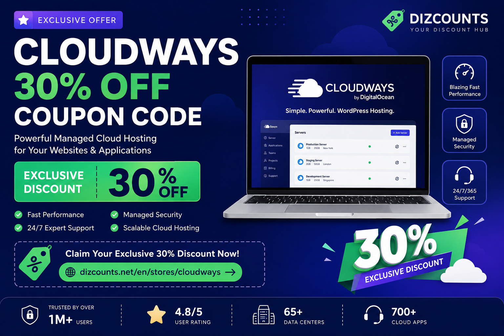

# Cloudways Coupon Code 2026 – Get Exclusive 30% Off Cloud Hosting

Looking for a working **Cloudways coupon code**, **Cloudways discount**, or **Cloudways promo code**?

You can now get an **exclusive 30% discount on Cloudways** through Dizcounts.

👉 **Claim the Cloudways 30% Discount Here:**  
https://dizcounts.net/en/stores/cloudways

---

## ✅ Latest Cloudways Discount

| Offer | Details |
|---|---|
| Discount | Exclusive 30% Off |
| Store | Cloudways |
| Coupon Type | Cloud Hosting Discount |
| Verified By | Dizcounts |
| Best For | Developers, agencies, startups, WordPress sites, WooCommerce stores, Laravel apps |

Cloudways is a managed cloud hosting platform built for users who want powerful hosting without manually managing servers.

With this Cloudways coupon, you can save on managed cloud hosting and launch websites, apps, and stores with better performance and flexibility.

---

## 🔥 Get 30% Off Cloudways Hosting

Dizcounts provides an exclusive Cloudways discount to help you save on managed cloud hosting plans.

Use the link below to access the latest verified Cloudways coupons and offers:

👉 **Cloudways 30% Off Coupon:**  
https://dizcounts.net/en/stores/cloudways

---

## Why Use a Cloudways Coupon?

Cloud hosting can become expensive as your websites grow. Using a verified Cloudways promo code helps reduce your hosting costs while still getting access to a powerful managed hosting environment.

A Cloudways discount is useful for:

- WordPress websites
- WooCommerce stores
- Laravel applications
- PHP projects
- Agency client websites
- High-traffic blogs
- SaaS landing pages
- Business websites
- Performance-focused hosting setups

---

## About Cloudways

Cloudways is a managed cloud hosting platform that allows users to host websites and applications on cloud infrastructure without handling low-level server management.

Instead of manually configuring servers, security, caching, backups, and deployment settings, Cloudways gives users a simplified dashboard for managing hosting environments.

It is commonly used by developers, agencies, freelancers, eCommerce owners, and website owners who need scalable hosting.

---

## How to Claim the Cloudways 30% Discount

Follow these simple steps:

1. Visit the Cloudways coupon page on Dizcounts:  
   https://dizcounts.net/en/stores/cloudways

2. Choose the latest available Cloudways offer.

3. Reveal the coupon or click the deal button.

4. Continue to Cloudways.

5. Complete your signup or purchase.

6. Enjoy your Cloudways hosting discount.

---

## Best Cloudways Coupon Code

The best available Cloudways coupon from Dizcounts gives you:

> **Exclusive 30% Off Cloudways Hosting**

Claim it here:

👉 https://dizcounts.net/en/stores/cloudways

---

## Cloudways Promo Code for WordPress Hosting

Cloudways is a popular choice for WordPress hosting because it provides managed cloud performance without requiring users to configure everything manually.

If you are building a WordPress website, blog, or WooCommerce store, using a Cloudways promo code can help reduce your starting cost.

👉 Get the Cloudways WordPress hosting discount:  
https://dizcounts.net/en/stores/cloudways

---

## Cloudways Coupon for Laravel Developers

Cloudways is also useful for PHP and Laravel developers who want managed cloud hosting with better control than traditional shared hosting.

If you are deploying Laravel apps, APIs, dashboards, or business platforms, this Cloudways discount may help you start with lower hosting costs.

👉 Claim the Cloudways Laravel hosting coupon:  
https://dizcounts.net/en/stores/cloudways

---

## Cloudways Discount for Agencies

Agencies often manage multiple client websites and need hosting that can scale as projects grow.

A Cloudways coupon can help agencies reduce initial hosting costs while testing or launching client projects.

👉 View the latest Cloudways agency discount:  
https://dizcounts.net/en/stores/cloudways

---

## Why Choose Dizcounts for Cloudways Coupons?

Dizcounts helps users find active coupons, deals, and discounts for hosting, domains, software, and online services.

The platform focuses strongly on hosting and domain-related offers, including providers like Cloudways, Hostinger, DigitalOcean, and other web service platforms.

Dizcounts also provides store pages where users can view all available coupons for a specific brand, making it easier to compare and claim offers.

---

## Cloudways Coupon FAQ

### Does Cloudways have a coupon code?

Yes. You can claim an exclusive Cloudways discount through Dizcounts.

👉 https://dizcounts.net/en/stores/cloudways

---

### What is the current Cloudways discount?

The current featured offer is:

> **Exclusive 30% Off Cloudways**

You can check the latest available coupon here:

👉 https://dizcounts.net/en/stores/cloudways

---

### Is the Cloudways coupon verified?

Dizcounts lists available Cloudways coupons and offers on a dedicated Cloudways store page.

Always check the coupon page for the latest status, terms, and availability:

👉 https://dizcounts.net/en/stores/cloudways

---

### Can I use the Cloudways coupon for WordPress hosting?

Yes, Cloudways is commonly used for WordPress hosting. You can use the available discount when eligible.

---

### Can I use the Cloudways coupon for WooCommerce hosting?

Cloudways is often used for WooCommerce stores because managed cloud hosting can help with performance and scalability.

Check the latest Cloudways offer here:

👉 https://dizcounts.net/en/stores/cloudways

---

### Can developers use this Cloudways discount?

Yes. Developers building PHP, Laravel, WordPress, and custom web applications can benefit from Cloudways hosting discounts.

---

### Where can I find the best Cloudways promo code?

You can find the latest Cloudways coupon codes and discounts on Dizcounts:

👉 https://dizcounts.net/en/stores/cloudways

---

## Related Keywords

This page is useful for users searching for:

- Cloudways coupon code
- Cloudways discount
- Cloudways promo code
- Cloudways 30% off
- Cloudways hosting coupon
- Cloudways WordPress coupon
- Cloudways Laravel hosting discount
- Cloudways managed hosting coupon
- Cloudways promo code 2026
- Cloudways discount code 2026
- Cloudways coupon for developers
- Cloudways agency hosting discount
- Cloudways WooCommerce hosting coupon

---

## Final Recommendation

If you are planning to use Cloudways for WordPress, WooCommerce, Laravel, PHP apps, or managed cloud hosting, do not pay full price before checking the latest available coupon.

👉 **Claim the exclusive Cloudways 30% discount here:**  
https://dizcounts.net/en/stores/cloudways

---

## Disclaimer

This repository is created to help users find Cloudways coupons, promo codes, and hosting discounts. Coupon availability, discount percentage, and terms may change at any time. Always check the official offer page before purchasing.

Dizcounts may earn a commission when users click affiliate links or purchase through listed offers, at no extra cost to the user.
